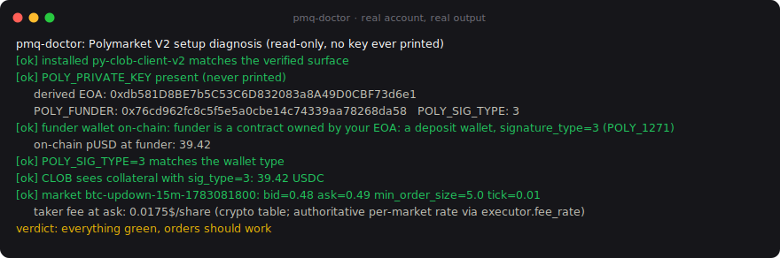

# pmq

<!-- mcp-name: io.github.crp4222/pmq -->

[](https://pypi.org/project/pmquant/)
[](https://github.com/crp4222/pmq/actions/workflows/test.yml)
[](https://github.com/crp4222/pmq/actions/workflows/canary.yml)
[](.github/workflows/test.yml)
[](pyproject.toml)
[](https://scorecard.dev/viewer/?uri=github.com/crp4222/pmq)
[](LICENSE)

Fail-closed execution and market data for **Polymarket CLOB V2**, in Python.
Local signing (your keys never leave your process), exchange-confirmed fills
only, fee-correct math, and deposit-wallet (`POLY_1271`) support that actually
works in production.

```bash
pip install pmquant        # distribution name pmquant, import name pmq
```

(PyPI's similarity check reserves the bare name; the module you import is
`pmq`, same pattern as beautifulsoup4/bs4.)

As of 2026-07-03 this is, to our knowledge, the **only maintained Python
layer combining local CLOB V2 signing, an exchange-confirmed fill contract,
and working deposit-wallet (POLY_1271) auth**. That claim is dated and
falsifiable: the comparison table below names the alternatives and what each
does instead; open an issue if it goes stale.

## Why this exists

Polymarket cut over to CLOB V2 on 2026-04-28. V1-signed orders are rejected in
production, the fee schedule is decided at match time, and the official client
examples leave several traps undocumented. Every line of pmq was paid for with
a real error in live trading:

* `invalid amounts, the market buy orders maker amount supports a max accuracy
  of 2 decimals, taker amount a max of 4 decimals`: the CLOB treats FAK/FOK
  buys as **market orders** and caps their signed amounts at 2 decimals
  (maker) / 4 decimals (taker) whatever the tick size. The official client's
  rounding table allows 5-6 taker decimals on markets whose tick is finer
  than 0.01 (any book trading past 0.96 or under 0.04), so market orders
  there are rejected wholesale (reported upstream:
  [py-clob-client-v2#99](https://github.com/Polymarket/py-clob-client-v2/issues/99)).
  pmq clamps the signed
  pair to the exchange caps before signing and refuses at startup any
  client build that would still sign a rejectable pair, so the trap cannot
  reach your orders. Measurements in
  [docs/rounding-study.md](docs/rounding-study.md).
* `no orders found to match with FAK order` (HTTP 400, yet with an `orderID`):
  a clean no-fill, not an error. pmq returns an empty `Fill` instead of crashing
  or, worse, retrying blindly.
* CLOB shows `balance: 0` while your pUSD sits on-chain: the balance endpoint
  ignores your `funder` parameter and derives the wallet from your EOA and
  `signature_type`. Funds in the Polymarket app's default wallet (an ERC-1271
  deposit wallet) are only visible with `signature_type=3`.

The full write-up with reproduction details: [docs/war-story.md](docs/war-story.md).

## Runs in production: my own money, daily

I built pmq for my own trading. It executes real volume with my funds every
day, and it has never booked a fill the exchange did not confirm. If you
want to see it on-chain, here is a settlement from one of my wallets
(2026-07-03):
[`0x387f5f09...100d88a8`](https://polygonscan.com/tx/0x387f5f09c031bb36a71c54adc978b1ed4d50c67f6dd3f0c2c8068391100d88a8)
on the CTF Exchange V2: a FAK market buy built by this library, matched and
settled, with the builder code visible in the calldata. A weekly
[canary workflow](.github/workflows/canary.yml) exercises the real endpoints
and the installed client surface, and opens an issue by itself if Polymarket
drifts.

## pmq-doctor: diagnose your setup in one command

```bash
pip install pmquant && pmq-doctor --market <slug>
```

It checks, in order: the installed client surface (introspection), your
derived EOA, the funder wallet on-chain (`owner()` and bytecode: is it a
deposit wallet?), whether `POLY_SIG_TYPE` matches the wallet type, whether
the CLOB actually sees your collateral (and if not, WHICH sig_type does),
and the target market's minimum size and tick. Real output on a real
deposit-wallet account:



If you landed here from "the order signer address has to be the address of
the API KEY" or a CLOB balance of 0 with funds on-chain: this is the tool.

## The contract: nothing is booked without exchange confirmation

| Situation | What pmq does |
|---|---|
| Response is a dict with `orderID`, not flagged failed | `Fill` with the **matched** size read from the response |
| Error dict on HTTP 200, string body, `success: false` | `Fill(rejected=True)`, zero booked |
| HTTP 4xx (incl. FAK no-match) | `Fill(rejected=True)`, zero booked |
| Timeout, 5xx, exception after send | raises `OrderUncertain`: the order MAY exist. Call `reconcile()` before trading that market again |
| Unparseable matched amounts | zero booked (fail closed) |

`reconcile(condition_id)` cancels anything resting, verifies nothing stayed
open, and returns `(shares, usd, fees)` from `get_trades`: the exchange truth,
not your hopes.

At startup pmq **introspects the installed py-clob-client-v2** against the API
surface it was verified on, and refuses to trade on drift instead of sending
orders through changed semantics. The whole table is pinned by an executable
test per row plus a hypothesis fuzz suite (hundreds of generated adversarial
responses per run, including NaN/Infinity and negative amounts, which book
zero).

## Quickstart

Market data needs no keys:

```python
import pmq

m = pmq.parse_market(pmq.get_market("btc-updown-15m-1783062000"))
book = pmq.get_book(m["token_a"])
bid, bid_sz, ask, ask_sz = pmq.best_bid_ask(book)
print(ask, pmq.band_ask_depth_usd(book, 0.90, 0.97))
print(pmq.fee(price=0.95, shares=100))          # taker fee in $, crypto rate
```

Execution (reads `POLY_PRIVATE_KEY`, `POLY_FUNDER`, `POLY_SIG_TYPE` from the
environment):

```python
from pmq import PolymarketExecutor, OrderUncertain

ex = PolymarketExecutor()                        # signature_type=3 for the app's deposit wallet
ex.require_collateral(5.0)                       # fail fast, with a diagnostic that names sig_type

try:
    fill = ex.buy_fak(token_id=m["token_a"], price_cap=0.95, usd=5.00)
except OrderUncertain:
    ex.reconcile(m["condition_id"], m["token_a"])   # exchange truth before anything else
else:
    if fill:                                     # book ONLY what matched
        print(fill.matched_shares, "shares at", fill.price, "order", fill.order_id)
```

`sell_fak` and `limit_gtc` follow the same contract. Both FAK paths have
carried real volume: a production round trip (buy 5.149 @ 0.94, sell back
5.14 @ 0.94, cross-checked via `get_trades`) confirmed the mirrored
`makingAmount`/`takingAmount` semantics on 2026-07-03.

## The signature_type table nobody gives you

| `signature_type` | Wallet | When it is yours |
|---|---|---|
| 0 | the EOA itself | you trade from a bare private key |
| 1 | `POLY_PROXY` | email/Magic accounts (legacy) |
| 2 | `POLY_GNOSIS_SAFE` | browser-wallet proxy |
| 3 | `POLY_1271` deposit wallet | **the Polymarket app's default wallet** |

If `collateral()` returns 0 while the funds are visible on-chain on your funder
address, your `signature_type` is wrong. Debug trick: `eth_call` `owner()`
(`0x8da5cb5b`) on the funder; if it returns your EOA and the wallet bytecode is
an ERC-1167 proxy, you want `signature_type=3`.

## Comparison (2026-07-03, factual)

| | pmq | py-clob-client-v2 (official) | pmxt | NautilusTrader | caiovicentino MCP |
|---|---|---|---|---|---|
| CLOB V2 signing | yes, local | yes, local | writes via its hosted backend | yes, local | V1 only (rejected in prod since 2026-04-28) |
| Confirmed-fill contract | yes (core design) | no (raw responses) | n/a | engine-level | no |
| Deposit wallet / POLY_1271 | yes, production-proven | open issues (#70 and others) | n/a | untested claim | no |
| Fee math | official per-category formula | fee at match, no helper | via backend | fee model | fee-blind |
| Reconciliation helper | yes | no | n/a | engine-level | no |
| Footprint | one small lib | one small lib | multi-venue platform | full trading framework | MCP server |

NautilusTrader is excellent if you want a full framework; pmq is the small
library you embed in your own bot. pmxt is convenient if you accept routing
writes through their backend; pmq exists for self-custody.

## Builder code disclosure

pmq ships with the maintainer's public Polymarket **builder code** as default
attribution inside signed orders (`pmq.executor.DEFAULT_BUILDER_CODE`). Its
commission is set to **0/0: it never adds any fee to your orders**. Attribution
feeds Polymarket's builder program and funds this project at zero cost to you.

Opt out or replace it, one line either way:

```python
PolymarketExecutor(builder_code=None)            # no attribution
PolymarketExecutor(builder_code="0xYOURS...")    # your own code
```

or set the `POLY_BUILDER_CODE` environment variable. (Same model as
JKorf/Polymarket.Net; the official client defaults to zero attribution.)

## MCP server (agents)

`pip install "pmquant[mcp]"` then run `pmq-mcp` (stdio). Listed in the
[official MCP registry](https://registry.modelcontextprotocol.io) as
`io.github.crp4222/pmq`. Read tools (market,
book, taker_fee, account_collateral, account_trades) always exist. Trading
tools (`fak_buy`, `fak_sell`, `cancel_and_reconcile`) are **only registered
when the operator sets `PMQ_MCP_LIVE=1`** in the server environment: an
agent cannot talk its way past a tool that was never created. Every order is
capped per call by `PMQ_MCP_MAX_USD` (default 10).

```json
{
  "mcpServers": {
    "pmq": {
      "command": "pmq-mcp",
      "env": { "POLY_PRIVATE_KEY": "...", "POLY_FUNDER": "0x...", "POLY_SIG_TYPE": "3" }
    }
  }
}
```

Leave the `POLY_*` variables out entirely for a read-only market-data server.

## Bot template

[bot-template/](bot-template/) is a complete bot minus the strategy, for ANY
market (politics, sports, crypto, culture): paper mode against real books
with real fees, per-market budgets with fee headroom, poisoned-market
reconciliation, consecutive-failure halt, disk-persisted daily loss halt, a
systemd unit with `RestartPreventExitStatus=42` so halts stay halted, and a
lightweight phone dashboard. You implement `watchlist()` and `decide()`; the
shipped demo strategy is an API illustration meant to be replaced.

## Security posture

* Keys are read from the environment, used to instantiate the signer, and
  never logged. No custody, no backend, no telemetry, zero network calls
  besides Polymarket endpoints.
* A documented wave of fake "polymarket bot" repositories steals private
  keys; pmq is deliberately small so the entire execution path stays
  readable in minutes by anyone who wants to look.
* Fund the trading wallet with what you can afford to lose. Nothing here is
  financial advice; prediction-market access is restricted in some
  jurisdictions and compliance is on you.

## If you feel like checking any of it

None of the claims above require taking my word; each one comes with a
handle you can pull, whenever you care to:

* **Egress.** `PMQ_CANARY=1 pytest tests/test_canary_live.py -k egress -s`
  records every DNS resolution during a full session (market data, auth
  derivation, one signed order) and fails on any host outside
  `polymarket.com`. Last observed list: `clob.polymarket.com`,
  `gamma-api.polymarket.com`, nothing else. The weekly
  [canary](../../actions/workflows/canary.yml) prints that list in public
  CI logs. One designed exception: `pmq-doctor`'s optional on-chain checks
  use the public Polygon RPCs named in its source.
* **Provenance.** Releases carry a signed PEP 740 attestation (Sigstore,
  via PyPI trusted publishing): click "provenance" next to any file on the
  [PyPI files page](https://pypi.org/project/pmquant/#files), or fetch it
  raw from PyPI's integrity API. The signing identity is this repository's
  `publish.yml` workflow.
* **Dependencies.** Dependabot files weekly bump PRs (Python and
  SHA-pinned GitHub Actions), and the weekly canary runs `pip-audit`; a
  hit opens an issue by itself.
* **The source.** Five small modules; the whole execution path reads in
  minutes. The grep targets that answer the important questions fastest
  are listed in [SECURITY.md](SECURITY.md).

## Stability and maintenance

* Pre-1.0 SemVer: PATCH releases only fix, MINOR releases may change the
  public API with the migration named in [CHANGELOG.md](CHANGELOG.md).
  Nothing changes silently.
* Deprecated APIs keep working and warn for at least one MINOR release
  before removal.
* The bar for 1.0, stated in advance: months of green weekly canaries, the
  maker path (`limit_gtc`) production-proven with real volume the way the
  FAK paths already are, and external production users.
* Bus-factor honesty: one maintainer, who trades real money through this
  exact code daily (strongest available incentive to keep it correct). The
  mitigations are structural, not promises: five small modules, the
  executable fill-contract test table, a weekly canary that opens issues by
  itself, SHA-pinned CI. Operational rule: if the canary badge goes red and
  stays red, treat the project as unmaintained and pin your last known-good
  version.
* Help wanted, precisely scoped: production receipts for `signature_type`
  1 and 2 accounts (legacy Magic/email and browser-wallet proxies). Both
  paths are introspection-tested but have never carried real money through
  this library; the maintainer's own accounts are all types 0 and 3.

## License

MIT
